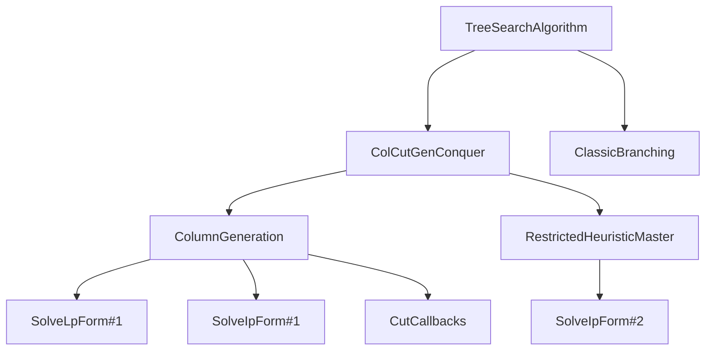
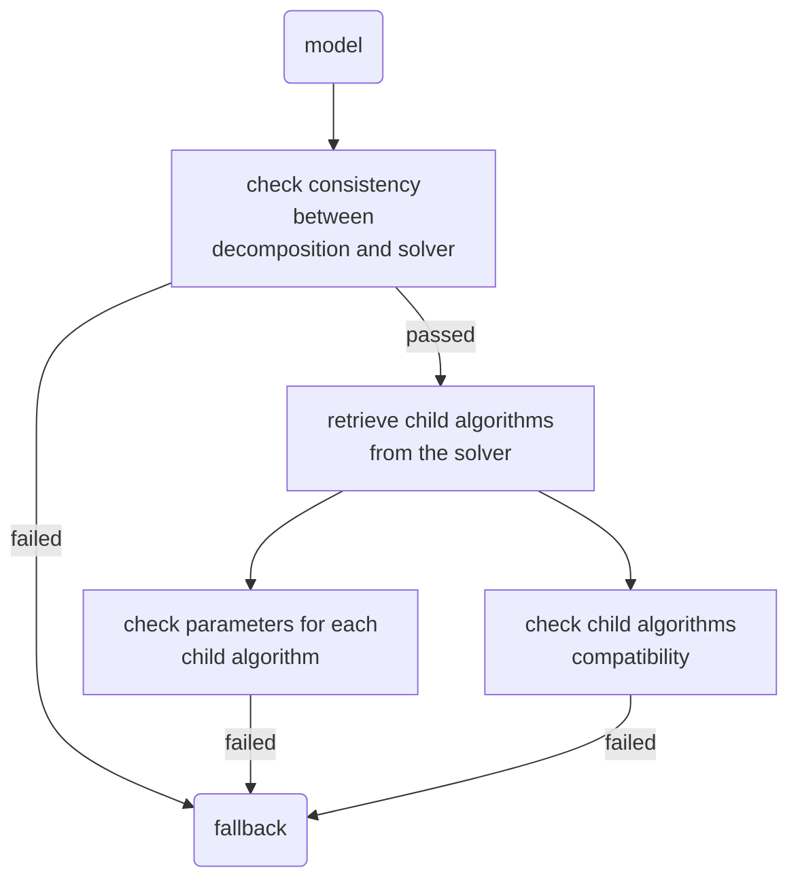

# Algorithms

## Parameters of an algorithm

From a user perspective, the algorithms are objects that contains a set of parameters.

The object must inherit from `Coluna.AlgoAPI.AbstractAlgorithm`.
We usually provide a keyword constructor to define default values for parameters and therefore ease the definition of the object.

```julia
struct MyCustomAlgorithm <: Coluna.AlgoAPI.AbstractAlgorithm
    param1::Int
    param2::Float64
    child_algo::Coluna.AlgoAPI.AbstractAlgorithm
end

# Help the user to define the algorithm:
function MyCustomAlgorithm(;
    param1 = 1,
    param2 = 2,
    child_algo = AnotherAlgorithm()
) 
    return MyCustomAlgorithm(param1, param2, child_algo)
end
```

Algorithms can use other algorithms. They are organized as a tree structure.

** Example for the TreeSearchAlgorithm **:



```@docs
Coluna.AlgoAPI.AbstractAlgorithm
```

## Init

### Parameters checking

When Coluna starts, it initializes the algorithms chosen by the user.
A most important step is to check the consistency of the parameters supplied by the user and the compatibility of the algorithms with the model that will be received (usually `MathProg.Reformulation`).
Algorithms usually have many parameters and are sometimes interdependent and nested.
It is crucial to ensure that the user-supplied parameters are correct and give hints to fix them otherwise.

The entry-point of the parameter consistency checking is the following method:

```@docs
Coluna.Algorithm.check_alg_parameters
```

Developer of an algorithm must implement the following methods:

```@docs
Coluna.Algorithm.check_parameter
```

### Units usage


```@docs
Coluna.AlgoAPI.get_child_algorithms
Coluna.AlgoAPI.get_units_usage
```

## Run


```@docs
Coluna.AlgoAPI.run!
```


## Checking strategies

The entry point for user-supplied parameters is the ```optimize!``` function, which takes as input the model containing both the user-customized solver and the decomposition used. The entry point for checks ```check_model_consistency``` is therefore logically located at the start of ```optimize!```. 

```
"""
    Entry point for the user-supplied parameters checking.
"""
check_model_consistency(::Model) = nothing ## TODO
```

An initial compatibility check between solver and decomposition is performed before diving into the tree of algorithms used to check their consistency.

```
"""
    Checks if the decomposition supplied by the user is compatible with the solver. 
"""
support(::AbstractSolver, ::AbstractDecomposition) = nothing ## TODO
```

We then retrieve the child algorithms (i.e. the nested algorithms used as solver parameters)
```
"""
    Returns all the algorithms used directly or indirectly by the solver. 
"""
get_child_algorithms(::AbstractSolver) = nothing ## TODO
``` 

Each unit algorithm is responsible for checking the consistency of its input parameters via ```check_parameters```. Compatibility checks between algorithms are performed on the fly with redefinitions of method ```support``` 

``` 
"""
    Checks the consistency of the parameters of the given algorithm. 
"""
check_parameters(alg::AbstractAlgorithm) = nothing ## TODO
```
```
"""
    Checks if a child algorithm can be called by a parent algorithm.  
"""
support(parent::AbstractAlgorithm, child::AbstractAlgorithm) = nothing ## 
``` 

The following diagram sums up the verification tree:

