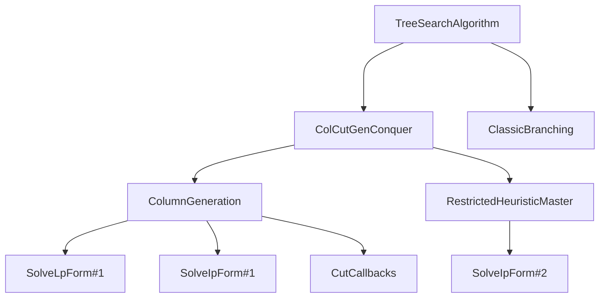

# Algorithms


!!! danger
    Work in progress.

## Parameters of an algorithm

From a user perspective, the algorithms are objects that contains a set of parameters.

The object must inherit from `Coluna.AlgoAPI.AbstractAlgorithm`.
We usually provide a keyword constructor to define default values for parameters and therefore ease the definition of the object.

```julia
struct MyCustomAlgorithm <: Coluna.AlgoAPI.AbstractAlgorithm
    param1::Int
    param2::Float64
    child_algo::Coluna.AlgoAPI.AbstractAlgorithm
end

# Help the user to define the algorithm:
function MyCustomAlgorithm(;
    param1 = 1,
    param2 = 2,
    child_algo = AnotherAlgorithm()
) 
    return MyCustomAlgorithm(param1, param2, child_algo)
end
```

Algorithms can use other algorithms. They are organized as a tree structure.

** Example for the TreeSearchAlgorithm **:



```@docs
Coluna.AlgoAPI.AbstractAlgorithm
```

## Init

### Parameters checking

When Coluna starts, it initializes the algorithms chosen by the user.
A most important step is to check the consistency of the parameters supplied by the user and the compatibility of the algorithms with the model that will be received (usually `MathProg.Reformulation`).
Algorithms usually have many parameters and are sometimes interdependent and nested.
It is crucial to ensure that the user-supplied parameters are correct and give hints to fix them otherwise.

The entry-point of the parameter consistency checking is the following method:

```@docs
Coluna.Algorithm.check_alg_parameters
```

Developer of an algorithm must implement the following methods:

```@docs
Coluna.Algorithm.check_parameter
```

### Units usage


```@docs
Coluna.AlgoAPI.get_child_algorithms
Coluna.AlgoAPI.get_units_usage
```

## Run


```@docs
Coluna.AlgoAPI.run!
```

