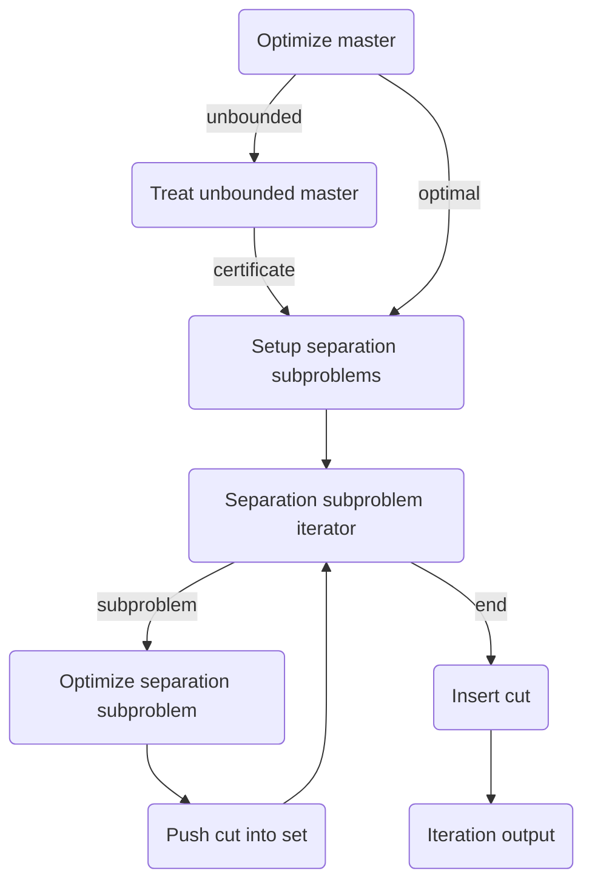

```@meta
CurrentModule = Coluna
```

# [Benders cut generation](@id api_benders)

Coluna provides an interface and generic functions to implement a Benders cut generation
algorithm.

In this section, we are first going to present the generic functions, the implementation with some theory backgrounds and then give the references of the interface.
The default implementation is based on the paper of 

You can find the generic functions and the interface in the `Benders` submodule and the 
default implementation in the `Algorithm` submodule at `src/Algorithm/benders`.

## Context

The `Benders` submodule provides an interface and generic functions to implement a benders cut generation algorithm. The implementation depends on an object called `context`.

```@docs
Coluna.Benders.AbstractBendersContext
```

Benders provides two types of context:

```@docs
Coluna.Algorithm.BendersContext
Coluna.Algorithm.BendersPrinterContext
```

## Generic functions

Generic functions are the core of the Benders cut generation algorithm.
There are three generic functions:

```@docs
Coluna.Benders.run_benders_loop!
```
See ...

```@docs
Coluna.Benders.run_benders_iteration!
```
See ...

These functions are independant of any other submodule of Coluna.
You can use them to implement your own Benders cut generation algorithm.

## Reformulation

The default implementation works with a reformulated problem contained in 
`MathProg.Reformulation` where master and subproblems are `MathProg.Formulation` objects.

The master has the following form:

```math
\begin{aligned}
\min        \quad& cx + \sum_{k \in K} \eta_k & &\\
\text{s.t.} \quad& Ax \geq a & & (1) \\
                 & \text{< benders cuts>} & & (2) \\
                 & l_1 \leq x \leq u_1 & & (3) \\
                 & \eta_k \in \mathbb{R} & \forall k \in K \quad& (4)
\end{aligned}
```

where $x$ are first-stage variables, 
$\eta_k$ is the second-stage cost variable for the subproblem $k$,
constraints $(1)$ are the first-stage constraints,
constraints $(2)$ are the Benders cuts,
constraints $(3)$ are the bounds on the first-stage variables,
and expression $(4)$ shows that second-stage variables are free.

The subproblems have the following form:

```math
\begin{aligned}
\min        \quad& fy  + \mathbf{1}z' + \mathbf{1}z''              &&&  \\
\text{s.t.} \quad& Dy + z' \geq d  - B\bar{x} && (5)  \quad& {\color{blue}(\pi)} \\
                        & Ey + z'' \geq e                  && (6)  \quad& {\color{blue}(\rho)} \\
                        & l_2 \leq y \leq u_2     && (7)  \quad& {\color{blue}(\sigma)}
\end{aligned}
```

where $y$ are second-stage variables, $z'$ and $z''$ are artificial variables,
constraints (5) are the reformulation of linking constraints using the first-stage solution $\bar{x}$,
constraints (6) are the second-stage constraints,
and constraints (7) are the bounds on the second-stage variables.
In blue, we define the dual variables associated to these constraints.


**References**:

```@docs
Coluna.Benders.is_minimization
Coluna.Benders.get_reform
Coluna.Benders.get_master
Coluna.Benders.get_benders_subprobs
```

## Main loop

This is a description of how the `Coluna.Benders.run_benders_loop!` generic function behaves with the default implementation.

The loop stops if one of the following conditions is met:
- the master is infeasible
- a separation subproblem is infeasible
- the time limit is reached
- the maximum number of iterations is reached
- no new cut generated at the last iteration

The default implementation returns:

```@docs

```

**References**:

```@docs
Coluna.Benders.setup_reformulation!
Coluna.Benders.stop_benders
Coluna.Benders.after_benders_iteration
Coluna.Benders.AbstractBendersOutput
Coluna.Benders.benders_output_type
Coluna.Benders.new_output
```

## Benders cut generation iteration




### Master optimization

The Benders cut generation algorithm is an iterative algorithm that consists in fixing a part of the variable

At each iteration, the algorithm fixes the first-level solution.

The default implementation optimizes the master with an MILP solver through MathOptInterface.
It returns a primal solution.

```@docs
Coluna.Benders.optimize_master_problem!
```

### Unbounded master case

If the master is unbounded...

**References**:

```@docs
Coluna.Benders.treat_unbounded_master_problem_case!
```

### Setup separation subproblems

Lorem ipsum.

**References**:
```@docs
Coluna.Benders.setup_separation_for_unbounded_master_case!
Coluna.Benders.update_sp_rhs!
```

### Subproblem iterator

Not implemented yet.

### Separation subproblem optimization

Lorem ipsum

**References**:

```@docs
Coluna.Benders.optimize_separation_problem!
Coluna.Benders.treat_infeasible_separation_problem_case!
```

### Set of generated cuts

Lorem ipsum:

**References**:

```@docs
Coluna.Benders.set_of_cuts
Coluna.Benders.set_of_sep_sols
Coluna.Benders.push_in_set!
```

### Cuts insertion

Lorem ipsum:

**References**:

```@docs
Coluna.Benders.insert_cuts!
```

### Iteration output

Lorem ipsum:

**References**:

```@docs
Coluna.Benders.AbstractBendersIterationOutput
Coluna.Benders.benders_iteration_output_type
Coluna.Benders.new_iteration_output
```

### Getters for Result data structures

| Method name      | Master | Separation |
| ---------------- | ------ | ---------- |
| `is_unbounded`   | X      | X          |
| `is_infeasible`  | X      | X          |
| `is_certificate` | X      |            |
| `get_primal_sol` | X      | X          |
| `get_dual_sol`   | X      |            |
| `get_obj_val`    | X      | X          |

```@docs
Coluna.Benders.is_unbounded
Coluna.Benders.is_infeasible
Coluna.Benders.is_certificate
Coluna.Benders.get_primal_sol
Coluna.Benders.get_dual_sol
Coluna.Benders.get_obj_val
```

## Stabilization

Not implemented yet.