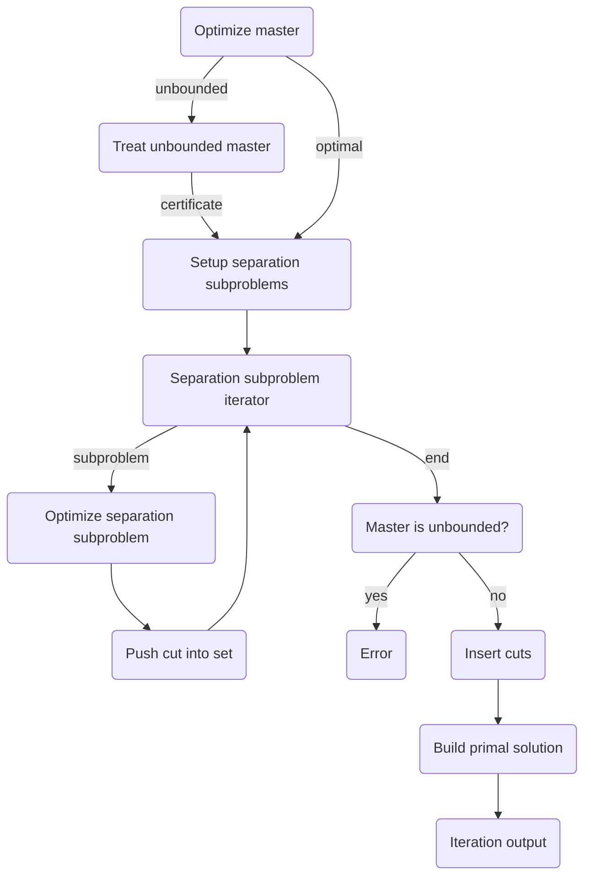

```@meta
CurrentModule = Coluna
```

# [Benders cut generation](@id api_benders)

Coluna provides an interface and generic functions to implement a Benders cut generation
algorithm.

In this section, we are first going to present the generic functions, the implementation with some theory backgrounds and then give the references of the interface.
The default implementation is based on the paper of 

You can find the generic functions and the interface in the `Benders` submodule and the 
default implementation in the `Algorithm` submodule at `src/Algorithm/benders`.

## Context

The `Benders` submodule provides an interface and generic functions to implement a benders cut generation algorithm. The implementation depends on an object called `context`.

```@docs
Coluna.Benders.AbstractBendersContext
```

Benders provides two types of context:

```@docs
Coluna.Algorithm.BendersContext
Coluna.Algorithm.BendersPrinterContext
```

## Generic functions

Generic functions are the core of the Benders cut generation algorithm.
There are three generic functions:

```@docs
Coluna.Benders.run_benders_loop!
```
See ...

```@docs
Coluna.Benders.run_benders_iteration!
```
See ...

These functions are independent of any other submodule of Coluna.
You can use them to implement your own Benders cut generation algorithm.

## Reformulation

The default implementation works with a reformulated problem contained in 
`MathProg.Reformulation` where master and subproblems are `MathProg.Formulation` objects.

The master has the following form:

```math
\begin{aligned}
\min        \quad& cx + \sum_{k \in K} \eta_k & &\\
\text{s.t.} \quad& Ax \geq a & & (1) \\
                 & \text{< benders cuts>} & & (2) \\
                 & l_1 \leq x \leq u_1 & & (3) \\
                 & \eta_k \in \mathbb{R} & \forall k \in K \quad& (4)
\end{aligned}
```

where $x$ are first-stage variables, 
$\eta_k$ is the second-stage cost variable for the subproblem $k$,
constraints $(1)$ are the first-stage constraints,
constraints $(2)$ are the Benders cuts,
constraints $(3)$ are the bounds on the first-stage variables,
and expression $(4)$ shows that second-stage variables are free.

The subproblems have the following form:

```math
\begin{aligned}
\min        \quad& fy  + {\color{gray} \mathbf{1}z' + \mathbf{1}z''}              &&&  \\
\text{s.t.} \quad& Dy {\color{gray} + z'} \geq d  - B\bar{x} && (5)  \quad& {\color{blue}(\pi)} \\
                        & Ey {\color{gray} + z''} \geq e                  && (6)  \quad& {\color{blue}(\rho)} \\
                        & l_2 \leq y \leq u_2     && (7)  \quad& {\color{blue}(\sigma)}
\end{aligned}
```

where $y$ are second-stage variables, $z'$ and $z''$ are artificial variables (in grey because they are deactivated by default),
constraints (5) are the reformulation of linking constraints using the first-stage solution $\bar{x}$,
constraints (6) are the second-stage constraints,
and constraints (7) are the bounds on the second-stage variables.
In blue, we define the dual variables associated to these constraints.

**References**:

```@docs
Coluna.Benders.is_minimization
Coluna.Benders.get_reform
Coluna.Benders.get_master
Coluna.Benders.get_benders_subprobs
```

## Main loop

This is a description of how the `Coluna.Benders.run_benders_loop!` generic function behaves with the default implementation.

The loop stops if one of the following conditions is met:
- the master is infeasible
- a separation subproblem is infeasible
- the time limit is reached
- the maximum number of iterations is reached
- no new cut generated at the last iteration

The default implementation returns:

```@docs
Coluna.Algorithm.BendersOutput
```

**References**:

```@docs
Coluna.Benders.setup_reformulation!
Coluna.Benders.stop_benders
Coluna.Benders.after_benders_iteration
Coluna.Benders.AbstractBendersOutput
Coluna.Benders.benders_output_type
Coluna.Benders.new_output
```

## Benders cut generation iteration

This is a description of how the `Coluna.Benders.run_benders_iteration!` generic function behaves with the default implementation.

These are the main steps of a Benders cut generation iteration without stabilization.
Click on the step to go to the corresponding section.



In the default implementation, some sections may have different behaviors depending on the 
result of previous steps.

### Master optimization

This operation consists in optimize the master problem in order to find a first-level
solution $\bar{x}$.

In the default implementation, master optimization can be performed using `SolveLpForm`
(LP solver) or `SolveIpForm` (MILP solver).
When getting the solution, we store the current value of second stage variables $\bar{\eta}_k$
as incumbent value (see `Coluna.MathProg.getcurincval`).

It returns an object of the following type:

```@docs
Coluna.Algorithm.BendersMasterResult
```

**References**:

```@docs
Coluna.Benders.optimize_master_problem!
```

Go back to the [cut generation iteration diagram](#Benders-cut-generation-iteration).

### Unbounded master case

Second stage cost $\eta_k$ variables are free.
As a consequence, the master problem is unbounded when there is no optimality Benders cuts.

In this case, `Coluna.Benders.treat_unbounded_master_problem_case!` is called.
The main goal of the default implementation of this method is to get the dual infeasibility
certificate of the master problem.

If the master has been solved with a MIP solver at the previous step, we need to relax
the integrality constraints to get a dual infeasibility certificate.

If the solver does not provide a dual infeasibility certificate, the implementation
has an "emergency" routine to provide a first-stage feasible solution by solving the master LP with cost of second stage variables set to zero.
We recommend using a solver that provides a dual infeasibility certificate and avoiding the "emergency" routine.

**References**:

```@docs
Coluna.Benders.treat_unbounded_master_problem_case!
```

Go back to the [cut generation iteration diagram](#Benders-cut-generation-iteration).

### Setup separation subproblems

!!! info
    The separation subproblems differs depending on whether the restricted master is unbounded or not:
    - if the restricted master is optimal, the generic function calls `Coluna.Benders.update_sp_rhs!`
    - if the restricted master is unbounded, the generic function calls `Coluna.Benders.setup_separation_for_unbounded_master_case!`

Default implementation of `Coluna.Benders.update_sp_rhs!` updates the right-hand side of the linking constraints (5).

**Reference**:
```@docs
Coluna.Benders.update_sp_rhs!
```

Default implementation of `Coluna.Benders.setup_separation_for_unbounded_master_case!`
gives raise to the formulation proposed in Lemma 2 of Bonami et al:

```math
\begin{aligned}
\min        \quad& fy  + {\color{gray} \mathbf{1}z' + \mathbf{1}z''}              &&&  \\
\text{s.t.} \quad& Dy {\color{gray} + z'} \geq -B\bar{x} && (5a)  \quad& {\color{blue}(\pi)} \\
                        & Ey {\color{gray} + z''} \geq 0                  && (6a)  \quad& {\color{blue}(\rho)} \\
                        & y \geq 0     && (7a)  \quad& {\color{blue}(\sigma)}
\end{aligned}
```
where $y$ are second-stage variables, $z'$ and $z''$ are artificial variables (in grey because they are deactivated by default), and $\bar{x}$ is the an unbounded ray of the restricted master.

**Reference**:

```@docs
Coluna.Benders.setup_separation_for_unbounded_master_case!
```

### Subproblem iterator

Not implemented yet.

### Separation subproblem optimization

The default implementation first optimize the subproblem without the artificial variables
$z'$ and $z''$.
In the case where it finds $(\bar{\pi}, \bar{\rho}, \bar{\sigma})$ an optimal dual solution to the subproblem, the following cut is generated:

```math
\eta_k + \bar{\pi}Bx \geq d\bar{\pi} + \bar{\rho}e + \bar{\sigma_{\leq}} l_2 + \bar{\sigma_{\geq}} u_2
```

In the case where it finds the subproblem infeasible, it calls `Coluna.Benders.treat_infeasible_separation_problem_case!`.
The default implementation of this method activates the artificial variables $z'$ and $z''$, set the cost of second stage variables to 0, and optimize the subproblem again.

If a solution with no artificial variables is found, the following cut is generated:

```math
\bar{\pi}Bx \geq d\bar{\pi} + \bar{\rho}e + \bar{\sigma_{\leq}} l_2 + \bar{\sigma_{\geq}} u_2
```

Both methods return an object of the following type:

```@docs
Coluna.Algorithm.BendersSeparationResult
```

**References**:

```@docs
Coluna.Benders.optimize_separation_problem!
Coluna.Benders.treat_infeasible_separation_problem_case!
```

Go back to the [cut generation iteration diagram](#Benders-cut-generation-iteration).

### Set of generated cuts

You can define your data structure to manage the cuts generated at a given iteration.
Columns are inserted after the optimization of all the separation subproblems to allow
the parallelization of the latter.

In the default implementation, cuts are represented by the following data structure:

```@docs
Coluna.Algorithm.GeneratedCut
```

We use the following data structures to store the cuts and the primal solutions to the subproblems:

```@docs
Coluna.Algorithm.CutsSet
Coluna.Algorithm.SepSolSet
```

**References**:

```@docs
Coluna.Benders.set_of_cuts
Coluna.Benders.set_of_sep_sols
Coluna.Benders.push_in_set!
```

Go back to the [cut generation iteration diagram](#Benders-cut-generation-iteration).

### Unboundedness check

!!! info
    This check is performed only when the restricted master is unbounded.


**References**:

```@docs
Coluna.Benders.master_is_unbounded
```

### Cuts insertion

The default implementation inserts into the master all the cuts stored in the `` object.

**References**:

**References**:

```@docs
Coluna.Benders.insert_cuts!
```

Go back to the [cut generation iteration diagram](#Benders-cut-generation-iteration).

### Current primal solution

Lorem ipsum.

**References**:
```@docs
Coluna.Benders.build_primal_solution
```

### Iteration output

```@docs
Coluna.Algorithm.BendersIterationOutput
```

**References**:

```@docs
Coluna.Benders.AbstractBendersIterationOutput
Coluna.Benders.benders_iteration_output_type
Coluna.Benders.new_iteration_output
```
Go back to the [cut generation iteration diagram](#Benders-cut-generation-iteration).

### Getters for Result data structures

| Method name      | Master | Separation |
| ---------------- | ------ | ---------- |
| `is_unbounded`   | X      | X          |
| `is_infeasible`  | X      | X          |
| `is_certificate` | X      |            |
| `get_primal_sol` | X      | X          |
| `get_dual_sol`   | X      |            |
| `get_obj_val`    | X      | X          |

```@docs
Coluna.Benders.is_unbounded
Coluna.Benders.is_infeasible
Coluna.Benders.is_certificate
Coluna.Benders.get_primal_sol
Coluna.Benders.get_dual_sol
Coluna.Benders.get_obj_val
```

Go back to the [cut generation iteration diagram](#Benders-cut-generation-iteration).

## Stabilization

Not implemented yet.