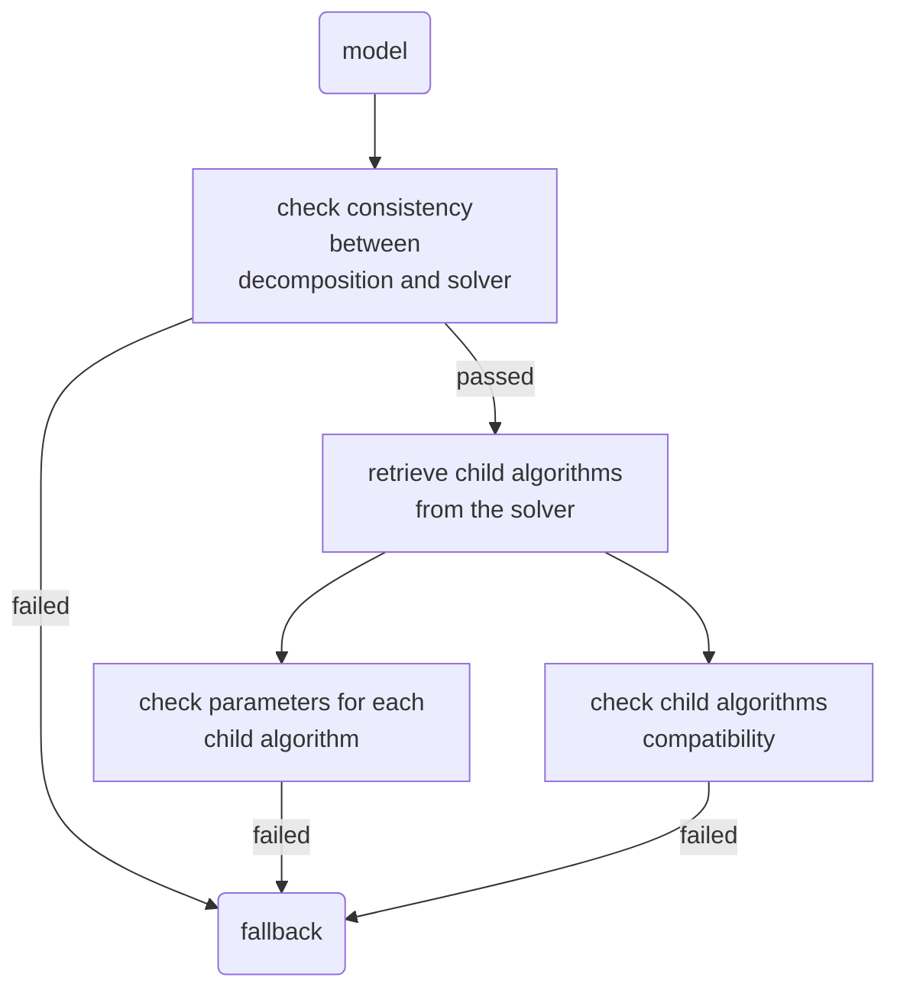

# Verification of algorithms parameters and consistency

The algorithms used in Coluna usually have many parameters and are sometimes interdependent and nested.
As a result, it is crucial to perform checks when the user parameters the solver.
In this section, we describe the strategies put in place to ensure the consistency of the parameters and algorithms used.


## API

```@docs
Coluna.Algorithm.get_child_algorithms
```


# Draft below

## Abstract types 

Several abstract types are used to organize, clarify and make code more concise. 
```
"""
    The generic type of any algorithm.
"""
abstract type AbstractAlgorithm end
```

```
"""
    An algorithm that solves a MIP.
"""
abstract type AbstractSolver end
```

```
"""
    An algorithm used in a tree search solver to evaluate (conquer) a node.
"""
abstract type AbstractConquerAlgo end
```

```
"""
    An algorithm used in a tree search solver to generate nodes (branching).
"""
abstract type AbstractDivideAlgo end
``` 

```
"""
    A decomposition of the MIP ahead of its resolution.
"""
abstract type AbstractDecomposition end
```

## Checking strategies

The entry point for user-supplied parameters is the ```optimize!``` function, which takes as input the model containing both the user-customized solver and the decomposition used. The entry point for checks ```check_model_consistency``` is therefore logically located at the start of ```optimize!```. 

```
"""
    Entry point for the user-supplied parameters checking.
"""
check_model_consistency(::Model) = nothing ## TODO
```

An initial compatibility check between solver and decomposition is performed before diving into the tree of algorithms used to check their consistency.

```
"""
    Checks if the decomposition supplied by the user is compatible with the solver. 
"""
support(::AbstractSolver, ::AbstractDecomposition) = nothing ## TODO
```

We then retrieve the child algorithms (i.e. the nested algorithms used as solver parameters)
```
"""
    Returns all the algorithms used directly or indirectly by the solver. 
"""
get_child_algorithms(::AbstractSolver) = nothing ## TODO
``` 

Each unit algorithm is responsible for checking the consistency of its input parameters via ```check_parameters```. Compatibility checks between algorithms are performed on the fly with redefinitions of method ```support``` 

``` 
"""
    Checks the consistency of the parameters of the given algorithm. 
"""
check_parameters(alg::AbstractAlgorithm) = nothing ## TODO
```
```
"""
    Checks if a child algorithm can be called by a parent algorithm.  
"""
support(parent::AbstractAlgorithm, child::AbstractAlgorithm) = nothing ## 
``` 

The following diagram sums up the verification tree:

