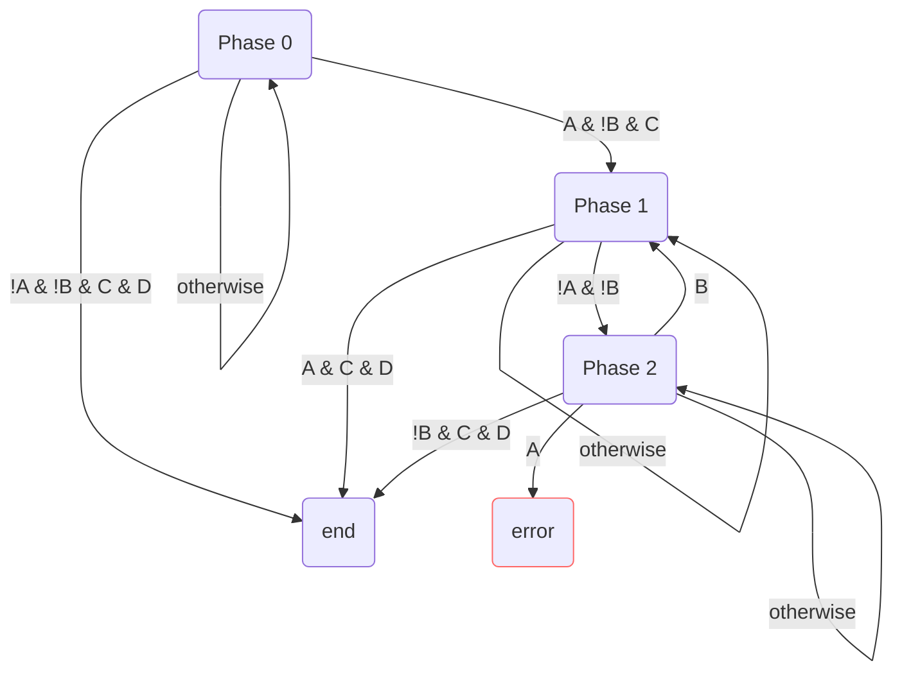
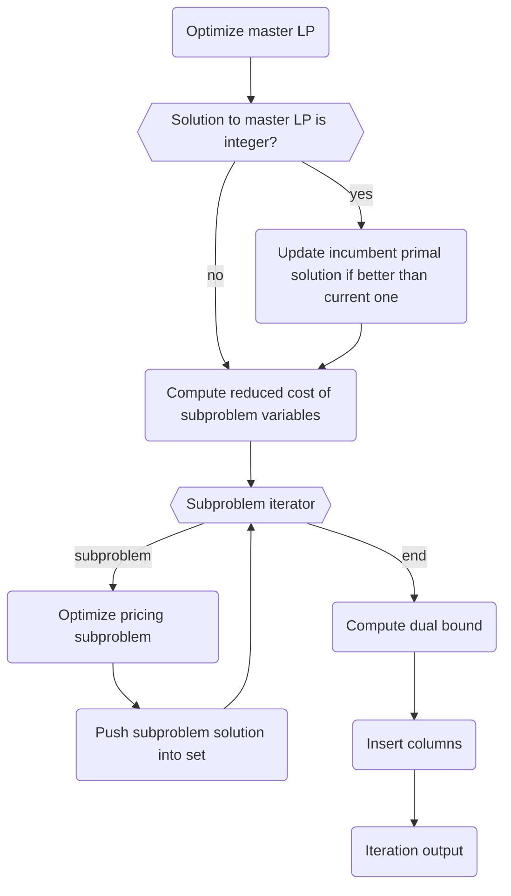

```@meta
CurrentModule = Coluna
```

# Column generation

Coluna provides an interface and generic functions to implement a multi-stage column 
generation algorithm together with a default implementation of this algorithm.

In this section, we are first going to present the generic functions, the implementation 
with some theory backgrounds and then give the references of the interface.

You can find the generic functions and the interface in the `ColGen` submodule and the default 
implementation in the `Algorithm` submodule at `src/Algorithm/colgen`.

## Context

The `ColGen` submodule provides an interface and generic functions to implement a column generation algorithm. The implementation depends on 
an object called `context`.

```@docs
Coluna.ColGen.AbstractColGenContext
```

Coluna provides two types of context:

```@docs
Coluna.Algorithm.ColGenContext
Coluna.Algorithm.ColGenPrinterContext
```

## Generic functions

Generic functions are the core of the column generation algorithm.
There are three generic functions:
    
```@docs
Coluna.ColGen.run!
```
See the [main loop](#Main-loop) section for more details.

```@docs
Coluna.ColGen.run_colgen_phase!
```
See the [phase loop](#Phase-loop) section for more details.

```@docs
Coluna.ColGen.run_colgen_iteration!
```
See the [column generation iteration](#Column-generation-iteration) section for more details.

They are independent of any other submodule of Coluna.
You can use them to implement your own column generation algorithm.

## Reformulation

The default implementation works with a reformulated problem contained in 
`MathProg.Reformulation` where master and subproblems are `MathProg.Formulation` objects.

The master has the following form:

```math
\begin{aligned}
\min \quad& \sum_{k \in K} c^k \lambda^k+\bar{c} y & \\
\text{s.t.} \quad& \sum_{k \in K} A^k \lambda^k+\bar{A} y \geq a  & (1)\\
& l_k \leq \mathbf{1} \lambda^k \leq u_k & (2) \\
& \bar{l} \leq y \leq \bar{u} & (3)
\end{aligned}
```

where $\lambda$ are the master columns, $y$ are the pure master variables,
constraints (1) are the linking constraints,
constraints (2) are the convexity constraints that depend on $l_k$ and $u_k$ (e.g. the lower
and upper multiplicity of the subproblem $k$ respectively),
and constraints (3) are the bounds on the pure master variables.

The subproblems have the following form:

```math
\begin{aligned}
\min \quad& cx + 0z \\
\text{s.t.} \quad& Bx \geq b \\
& 1 \leq z \leq 1
\end{aligned}
```

where $x$ are the subproblem variables, $z$ is a setup variable that always takes the value
one in a solution to the subproblem.

The coefficients of the columns in constraints (1) and (2) of the master are computed using
representative variables of the subproblems. 
You can read this section (TODO Natacha) to understand how we map the subproblem solutions
into master columns.

**References**:

```@docs
Coluna.ColGen.get_reform
Coluna.ColGen.get_master
Coluna.ColGen.get_pricing_subprobs
Coluna.ColGen.is_minimization
```

## Main loop

This is a description of how the `Coluna.ColGen.run!` generic function behaves in the default
implementation.

The main loop stops when the `Coluna.ColGen.stop_colgen` method returns `true`. This is the case when one of the following conditions holds: 
- the master or a pricing subproblem is infeasible
- the time limit is reached
- the maximum number of iterations is reached

Otherwise, the main loop runs until there is no more phase or stage to execute.

The method returns:

```@docs
Coluna.Algorithm.ColGenOutput
```

**References**:

```@docs
Coluna.ColGen.stop_colgen
Coluna.ColGen.setup_reformulation!
Coluna.ColGen.setup_context!
Coluna.ColGen.AbstractColGenOutput
Coluna.ColGen.colgen_output_type
Coluna.ColGen.new_output
```

## Phase loop

This is a description of how the `Coluna.ColGen.run_colgen_phase!` generic function behaves in the default implementation.

This function is responsible for maintaining the incumbent dual bound and the incumbent master IP primal solution.

The phase loop stops when the `Coluna.ColGen.stop_colgen_phase` method returns `true`. This is the case when one of the following conditions holds:
- the maximum number of iterations is reached
- the time limit is reached
- the master is infeasible
- the master is unbounded
- a pricing subproblem is infeasible
- a pricing subproblem is unbounded
- there is no new column generated at the last iteration
- there is a new constraint or valid inequality in the master
- the incumbent dual bound and the primal master LP solution value converged

The method returns:

```@docs
Coluna.Algorithm.ColGenPhaseOutput
```

**References**:

```@docs
Coluna.ColGen.stop_colgen_phase
Coluna.ColGen.before_colgen_iteration
Coluna.ColGen.after_colgen_iteration
Coluna.ColGen.is_better_dual_bound
```

### Phase iterator

In the first iterations, the restricted master LP contains a few columns and may be infeasible.
To prevent this, we introduced artificial variables $v$ and we activate/deactivate these variables
depending on whether we want to prove the infeasibility of the master LP or find the optimal
LP solution.
The default implementation provides three phases:

```@docs
Coluna.Algorithm.ColGenPhase0
Coluna.Algorithm.ColGenPhase1
Coluna.Algorithm.ColGenPhase2
```

Column generation always starts with Phase 0.

The default implementation of the phase iterator belongs to the following type:

```@docs
Coluna.Algorithm.ColunaColGenPhaseIterator
```

Transitions between the phases depend on four conditions:
- (A) the presence of artificial variables in the master LP solution
- (B) the generation of new essential constraints (may happen when a new master IP solution is found)
- (C) the current stage is exact
- (D) column generation converged 

Transitions are the following:



**References**:
```@docs
Coluna.ColGen.AbstractColGenPhase
Coluna.ColGen.AbstractColGenPhaseIterator
Coluna.ColGen.new_phase_iterator
Coluna.ColGen.initial_phase
Coluna.ColGen.decrease_stage
Coluna.ColGen.next_phase
```

### Phase output

```@docs
Coluna.ColGen.AbstractColGenPhaseOutput
Coluna.ColGen.colgen_phase_output_type
Coluna.ColGen.new_phase_output
```

## Stages

A stage is a set of consecutive iterations in which we use a given pricing solver.
The aim is to speed up the resolution of the pricing problem by first using an approximate but fast pricing algorithm and then switching to increasingly less heuristic algorithms until the last stage where an exact solver is used.
and an exact solver at the last stage.
Given a pricing solver, when the column generation does not progress anymore or the pricing
solver does not return any new column, the default implementation switch to a more exact
pricing solver.
Stages are created using the `stages_pricing_solver_ids` of the `ColumnGenerationAlgorithm`
parameter object.
The default implementation implements the interface around the following object:

```@docs
Coluna.Algorithm.ColGenStageIterator
```

**References**:
```@docs
Coluna.ColGen.AbstractColGenStage
Coluna.ColGen.AbstractColGenStageIterator
Coluna.ColGen.new_stage_iterator
Coluna.ColGen.initial_stage
Coluna.ColGen.next_stage
Coluna.ColGen.get_pricing_subprob_optimizer
Coluna.ColGen.stage_id
Coluna.ColGen.is_exact_stage
```

## Column generation iteration

This is a description of how the `Coluna.ColGen.run_colgen_iteration!` generic function behaves in the default implementation.

These are the main steps of a column generation iteration without stabilization.
Click on the step to go to the relevant section.



#### Optimize master LP

At each iteration, the algorithm requires a dual solution to the master LP to compute the
reduced cost of subproblem variables.

The default implementation optimizes the master with an LP solver through MathOptInterface.
It returns a primal and a dual solution.

In the default implementation, the master LP output is in the following data structure:

```@docs
Coluna.Algorithm.ColGenMasterResult
```


**References**:

```@docs
Coluna.ColGen.optimize_master_lp_problem!
```

You can see the additional methods to implement in the [result data structures](#Result-data-structures) section.


Go back to the [column generation iteration overview](#Column-generation-iteration).

#### Check the integrality of the master LP solution

The algorithm checks the integrality of
the primal solution to the master LP to improve the global primal bound of the branch-cut-price algorithm.

By default, the integrality check is done using the `MathProg.proj_cols_is_integer` method.
It implements the mapping procedure from the paper "F. Vanderbeck, Branching in branch-and-price: a generic scheme, Math.Prog. (2011)".
Basically, it sorts the column used in the master LP primal solution in lexicographic order. 
It assigns a weight to each column equal to the value of the column in the master LP solution. 
It then forms columns of weight one by accumulating the columns of the fractional solution. 
If columns are integral, the solution is integral.
This is a heuristic procedure so it can miss some integer solutions.

In the case the pricing subproblems are solved by a callback, and some subproblem integer variables are "hidden" from _Coluna_
(values of these variables are usually stored in `CustomData` associated with the pricing problem solution),
the mapping procedure may not be valid. In this case, the integrality should be checked in the "strict" way, i.e.,
by explicitly verifying that all columns are integer.

Integrality check procedure is set using parameter  `strict_integrality_check` (`false` by default) of the `ColumnGenerationAlgorithm`.

If the solution is integral, the essential cut callback is called to make sure it is feasible.

**References**:
```@docs
Coluna.ColGen.check_primal_ip_feasibility!
Coluna.ColGen.is_better_primal_sol
```

Go back to the [column generation iteration overview](#Column-generation-iteration).

#### Update incumbent primal solution

If the solution to master LP is integral and better than the current best one, 
we need to update the incumbent. This solution is then used by the tree-search algorithm in the 
bounding mechanism that prunes the nodes.

**References**:

```@docs
Coluna.ColGen.update_inc_primal_sol!
```

Go back to the [column generation iteration overview](#Column-generation-iteration).

#### Reduced costs calculation

Reduced costs calculation is written as a math operation in the `run_colgen_iteration!` 
generic function. As a consequence, the dual solution to the master LP and the 
implementation of the two following methods must return data structures that support math operations.

To speed up this operation, we cache data in the following data structure:

```@docs
Coluna.Algorithm.ReducedCostsCalculationHelper
```

Reduced costs calculation also requires the implementation of the two following methods:

```@docs
Coluna.ColGen.update_master_constrs_dual_vals!
Coluna.ColGen.update_reduced_costs!
Coluna.ColGen.get_subprob_var_orig_costs
Coluna.ColGen.get_subprob_var_coef_matrix
Coluna.ColGen.update_sp_vars_red_costs!
```

Go back to the [column generation iteration overview](#Column-generation-iteration).

#### Pricing subproblem iterator

The pricing strategy is basically an iterator used to iterate over the pricing subproblems
to optimize at each iteration of the column generation. The context can serve as a memory of
the pricing strategy to change the way we iterate over subproblems between each column
generation iteration.

The default implementation iterates over all subproblems.

Here are the references for the interface:

```@docs
Coluna.ColGen.AbstractPricingStrategy
Coluna.ColGen.get_pricing_strategy
Coluna.ColGen.pricing_strategy_iterate
```

Go back to the [column generation iteration overview](#Column-generation-iteration).

#### Pricing subproblem optimization

At each iteration, the algorithm requires primal solutions to the pricing subproblems. The generic function supports multi-column generation so you can return any number of solutions.

The default implementation supports optimization of the pricing subproblems using a MILP solver or a pricing callback. Non-robust valid inequalities are not supported by MILP solvers as they change the structure of the subproblems. When using a pricing callback, you must be aware of how Coluna calculates the reduced cost of a column:

The reduced cost of a column is split into three contributions:
- the contribution of the subproblem variables that is the primal solution cost given the reduced cost of subproblem variables
- the contribution of the non-robust constraints (i.e. master constraints that cannot be expressed using subproblem variables except the convexity constraint) that is not supported by MILP solver but that you must take into account in the pricing callback
- the contribution of the master convexity constraint that is automatically taken into account by Coluna once the primal solution is returned.

Therefore, when you use a pricing callback, you must not discard some columns based only on the primal solution cost because you don't know the contribution of the convexity constraint.

```@docs
Coluna.Algorithm.GeneratedColumn    
Coluna.Algorithm.ColGenPricingResult
```

**References**:
```@docs
Coluna.ColGen.optimize_pricing_problem!
```

You can see the additional methods to implement in the [result data structures](#Result-data-structures) section.

Go back to the [column generation iteration overview](#Column-generation-iteration).

#### Set of generated columns

You can define your data structure to manage the columns generated at a given iteration. Columns are inserted after the optimization of all pricing subproblems to allow the parallelization of the latter.

In the default implementation, we use the following data structure:

```@docs
Coluna.Algorithm.ColumnsSet
Coluna.Algorithm.SubprobPrimalSolsSet
```

In the default implementation, `push_in_set!` is responsible for checking if the column has improving reduced cost.
Only columns with improving reduced cost are inserted in the set.
The `push_in_set!` is also responsible to insert he best primal solution to each pricing problem into the `SubprobPrimalSolsSet` object.


**References**:

```@docs
Coluna.ColGen.set_of_columns
Coluna.ColGen.push_in_set!
```

Go back to the [column generation iteration overview](#Column-generation-iteration).

#### Dual bound calculation

In the default implementation, 
given a vector $\pi \geq 0$ of dual values to the master constraints (1), the Lagrangian 
dual function is given by:

```math
L(\pi) = \pi a + \sum_{k \in K} \max_{l_k \leq \mathbf{1} \lambda^k \leq u^k} (c^k - \pi A^k)\lambda^k + \max_{ \bar{l} \leq y \leq \bar{u}} (\bar{c} - \pi \bar{A})y
```

Let:
- element $z_k(\pi) \leq \min_i (c^k_i - \pi A^k_i)$ be a lower bound on the solution value of the pricing problem
- element $\bar{z}_j(\pi) = \bar{c} - \pi \bar{A}$ be the reduced cost of pure master variable $y_j$

Then, the Lagrangian dual function can be lower bounded by:

```math
L(\pi) \geq \pi a + \sum_{k \in K} \max\{ z_k(\pi) \cdot l_k,  z_k(\pi) \cdot u_k \}  + \sum_{j \in J}  \max\{ \bar{z}_j(\pi) \cdot \bar{l}_j,  \bar{z}_j(\pi) \cdot \bar{u}_j\}
```

More precisely:
- the first term is the contribution of the master obtained by removing the contribution of the convexity constraints (computed by `ColGen.Algorithm._convexity_contrib`), and the pure master variables (but you should see the third term) from the master LP solution value
- the second term is the contribution of the subproblem variables which is the sum of the best solution value of each pricing subproblem multiplied by the lower and upper multiplicity of the subproblem depending on whether the reduced cost is negative or positive (this is computed by `ColGen.Algorithm._subprob_contrib`)
- the third term is the contribution of the pure master variables which is taken into account by master LP value.

Therefore, we can compute the Lagrangian dual bound as follows:

```julia
master_lp_obj_val - convexity_contrib + sp_contrib
```

However, if the smoothing stabilization is active, we compute the dual bound at the sep-point. As a consequence, we can't use the master LP value because it corresponds to the dual solution at the out-point. We therefore need to compute the lagrangian dual bound by strictly applying the above formula.

**References**:

```@docs
Coluna.ColGen.compute_sp_init_pb
Coluna.ColGen.compute_sp_init_db
Coluna.ColGen.compute_dual_bound
```

Go back to the [column generation iteration overview](#Column-generation-iteration).

#### Columns insertion

The default implementation inserts into the master all the columns stored in the `ColumnsSet` object.

**Reference**:

```@docs
Coluna.ColGen.insert_columns!
```

Go back to the [column generation iteration overview](#Column-generation-iteration).

#### Iteration output

```@docs
Coluna.Algorithm.ColGenIterationOutput
```

**References**:

```@docs
Coluna.ColGen.AbstractColGenIterationOutput
Coluna.ColGen.colgen_iteration_output_type
Coluna.ColGen.new_iteration_output
```

Go back to the [column generation iteration overview](#Column-generation-iteration).

### Getters for Result data structures

| Method name      | Master | Pricing    |
| ---------------- | ------ | ---------- |
| `is_unbounded`   | X      | X          |
| `is_infeasible`  | X      | X          |
| `get_primal_sol` | X      |            |
| `get_primal_sols`|        | X          |
| `get_dual_sol`   | X      |            |
| `get_obj_val`    | X      |            |
| `get_primal_bound` |        | X          |
| `get_dual_bound` |        | X          |


**References**:

```@docs
Coluna.ColGen.is_unbounded
Coluna.ColGen.is_infeasible
Coluna.ColGen.get_primal_sol
Coluna.ColGen.get_primal_sols
Coluna.ColGen.get_dual_sol
Coluna.ColGen.get_obj_val
Coluna.ColGen.get_primal_bound
```

Go back to the [column generation iteration overview](#Column-generation-iteration).


### Getters for Output data structures

| Method name                | ColGen | Phase | Iteration |
| ----------------           | ------ | ----- | --------- |
| `get_nb_new_cols`          |        |       | X         |
| `get_master_ip_primal_sol` |    X   | X     | X         |
| `get_master_lp_primal_sol` |    X   |       |           |
| `get_master_dual_sol`      |    X   |       |           |
| `get_dual_bound`            |    X   |       |  X        |
| `get_master_lp_primal_bound` |   X   |       |           |
| `is_infeasible`            |    X   |      |         |

**References**:

```@docs
Coluna.ColGen.get_nb_new_cols
Coluna.ColGen.get_master_ip_primal_sol
Coluna.ColGen.get_master_lp_primal_sol
Coluna.ColGen.get_master_dual_sol
Coluna.ColGen.get_master_lp_primal_bound
```

Go back to the [column generation iteration overview](#Column-generation-iteration).

## Stabilization

Coluna provides a default implementation of the smoothing stabilization with a self-adjusted $\alpha$ parameter, $0 \leq \alpha < 1$.

At each iteration of the column generation algorithm, instead of generating columns for the dual solution to the master LP, we generate columns for a perturbed dual solution defined as follows:

```math
\pi^{\text{sep}} = \alpha \pi^{\text{in}} + (1-\alpha) \pi^{\text{out}}
```

where $\pi^{\text{in}}$ is the dual solution that gives the best Lagrangian dual bound so far (also called stabilization center) and $\pi^{\text{out}}$ is the dual solution to the master LP at the current iteration. 
This solution is returned by the default implementation of `Coluna.ColGen.get_stab_dual_sol`.

Some elements of the column generation change when using stabilization.

- Columns are generated using the smoothed dual solution $\pi^{\text{sep}}$ but we still need to compute the reduced cost of the columns using the original dual solution $\pi^{\text{out}}$.
- The dual bound is computed using the smoothed dual solution $\pi^{\text{sep}}$.
- The pseudo bound is computed using the smoothed dual solution $\pi^{\text{sep}}$.
- The smoothed dual bound can result in the generation of no improving columns. This is called a **misprice**. In that case, we need to move away from the stabilization center $\pi^{\text{in}}$ by decreasing $\alpha$.

When using self-adjusted stabilization, the smoothing coefficient $\alpha$ is adjusted to make the smoothed dual solution $\pi^{\text{sep}}$ closer to the best possible dual solution on the line between $\pi^{\text{in}}$ and $\pi^{\text{out}}$ (i.e. where the subgradient of the current primal solution is perpendicular to the latter line).
To compute the subgradient, we use the following data structure:

```@docs
Coluna.Algorithm.SubgradientCalculationHelper
```

**References**:

```@docs
Coluna.ColGen.setup_stabilization!
Coluna.ColGen.update_stabilization_after_master_optim!
Coluna.ColGen.get_stab_dual_sol
Coluna.ColGen.check_misprice
Coluna.ColGen.update_stabilization_after_pricing_optim!
Coluna.ColGen.update_stabilization_after_misprice!
Coluna.ColGen.update_stabilization_after_iter!
Coluna.ColGen.get_output_str
```
