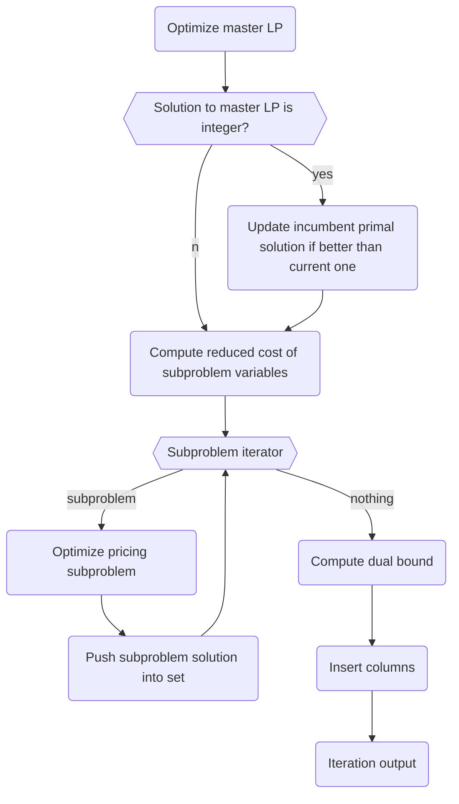

```@meta
CurrentModule = Coluna
```

# Column generation

Coluna provides an interface and generic functions to implement a multi-stage column 
generation algorithm together with a default implementation of this algorithm.

In this section, we are first going to present the generic functions, the implementation 
with some theory backgrounds and then give the references of the interface.

You can find the generic functions and the interface at `src/ColGen` and the default 
implementation at `src/Algorithm/colgen`.

## Generic functions

Generic functions are the core of the column generation algorithm.
There are three generic functions:
    
```@docs
Coluna.ColGen.run!
Coluna.ColGen.run_colgen_phase!
Coluna.ColGen.run_colgen_iteration!
```

They are independent of any other submodule of Coluna.
You can use them to implement your own column generation algorithm.

## Default implementation

The default implementation works with a reformulated problem contained in 
`MathProg.Reformulation` where master and subproblems are `MathProg.Formulation` objects.

The master has the following form:

```math
\begin{aligned}
\min \quad& \sum_{k \in K} c^k \lambda^k+\bar{c} y & \\
\text{s.t.} \quad& \sum_{k \in K} A^k \lambda^k+\bar{A} y \geq a  & (1)\\
& l_k \leq \mathbf{1} \lambda^k \leq u_k & (2) \\
& \bar{l} \leq y \leq \bar{u} & (3)
\end{aligned}
```

where $\lambda$ are the master columns, $y$ are the pure master variables,
constraints (1) are the linking constraints,
constraints (2) are the convexity constraints that depend on $l_k$ and $u_k$ (e.g. the lower
and upper multiplicity of the subproblem $k$ respectively),
and constraints (3) are the bounds on the pure master variables.

The subproblems have the following form:

```math
\begin{aligned}
\min \quad& cx + 0z \\
\text{s.t.} \quad& Bx \geq b \\
& 1 \leq z \leq 1
\end{aligned}
```

where $x$ are the subproblem variables, $z$ is a setup variable that always takes the value
one in a solution to the subproblem.

The coefficients of the columns in constraints (1) and (2) of the master are computed using
representative variables of the subproblems. 
You can read this section (TODO Natacha) to understand how we map the subproblem solutions
into master columns.


### Phases

In the first iterations, the restricted master LP contains a few columns and may be infeasible.
To prevent this, we introduced artificial variables $v$ and we activate/deactivate these variables
depending on whether we want to prove the infeasibility of the master LP or find the optimal
LP solution.
The default implementation provides three phases:

```@docs
Coluna.Algorithm.ColGenPhase1
Coluna.Algorithm.ColGenPhase2
Coluna.Algorithm.ColGenPhase3
```

Column generation always starts with Phase 3.
The cost of artificial variables in Phase 3 can be changed using the following methods:

```@docs
missing
```

**References**:
```@docs
Coluna.ColGen.AbstractColGenPhase
Coluna.ColGen.AbstractColGenPhaseIterator
Coluna.ColGen.new_phase_iterator
Coluna.ColGen.initial_phase
Coluna.ColGen.decrease_stage
Coluna.ColGen.next_phase
Coluna.ColGen.setup_reformulation!
Coluna.ColGen.setup_context!
Coluna.ColGen.stop_colgen_phase
```

### Stages

A stage is a set of consecutive iterations in which we use a given pricing solver.
The aim is to speed up the resolution of the pricing problem by first using an approximate but fast pricing algorithm and then switching to increasingly less heuristic algorithms until the last stage where an exact solver is used.
and an exact solver at the last stage.
Given a pricing solver, when the column generation does not progress anymore or the pricing
solver does not return any new column, the default implementation switch to a more exact
pricing solver.
Stages are created using the `stages_pricing_solver_ids` of the `ColumnGenerationAlgorithm`
parameter object.
The default implementation implements the interface around the following object:

```@docs
Coluna.Algorithm.ColGenStageIterator
```

**References**:
```@docs
Coluna.ColGen.AbstractColGenStage
Coluna.ColGen.AbstractColGenStageIterator
Coluna.ColGen.new_stage_iterator
Coluna.ColGen.initial_stage
Coluna.ColGen.next_stage
Coluna.ColGen.get_pricing_subprob_optimizer
Coluna.ColGen.stage_id
Coluna.ColGen.is_exact_stage
```

### Column generation iteration

These are the main steps of a column generation iteration without stabilization.
Click on the step to go to the relevant section.



#### Optimize master LP

At each iteration, the algorithm requires a dual solution to the master LP to compute the
reduced cost of subproblem variables.

The default implementation optimizes the master with an LP solver through MathOptInterface.
It returns a primal and a dual solution.

In the default implementation, the master LP output is in the following data structure:

```@docs
Coluna.Algorithm.ColGenMasterResult
```


**References**:

```@docs
Coluna.ColGen.optimize_master_lp_problem!
Coluna.ColGen.get_obj_val
Coluna.ColGen.get_primal_sol
Coluna.ColGen.get_dual_sol
Coluna.ColGen.is_optimal
Coluna.ColGen.is_infeasible
Coluna.ColGen.is_unbounded
```


Go back to the [column generation iteration overview](#Column-generation-iteration).

#### Check the integrality of the master LP solution

The algorithm checks the integrality of
the primal solution to the master LP to improve the global primal bound of the branch-cut-price algorithm.

In the default implementation, the integrality check is done using the `MathProg.proj_cols_is_integer` method.
It implements the procedure described in the paper (TODO).
Basically, it sorts the column used in the master LP primal solution
in lexicographic order. 
It assigns a weight to each column equal to the value of the column in the master LP solution. 
It then forms columns of weight one by accumulating the columns of the fractional solution. 
If columns are integral, the solution is integral.
This is a heuristic procedure so it can miss some integer solutions.

If the solution is integral, the essential cut callback is called to make sure it is feasible.

**References**:
```@docs
Coluna.ColGen.check_primal_ip_feasibility!
Coluna.ColGen.is_better_primal_sol
Coluna.ColGen.update_inc_primal_sol!
```

Go back to the [column generation iteration overview](#Column-generation-iteration).

#### Update incumbent primal solution

If the solution to master LP is integer and better than the current best one, 
we need to update incumbent. This solution is then used by the tree-search algorithm in the 
bounding mechanism that prunes the nodes.

**References**:

```@docs
Coluna.ColGen.isbetter
Coluna.ColGen.check_primal_ip_feasibility!
Coluna.ColGen.update_inc_primal_sol!
```

Go back to the [column generation iteration overview](#Column-generation-iteration).

#### Reduced costs calculation

Reduced costs calculation is written as a math operation in the `run_colgen_iteration!` 
generic function. As a consequence, the dual solution to the master LP and the 
implementation of the two following methods must return data structures that support math operations.

Reduced costs calculation also requires the implementation of the two following methods:

```@docs
Coluna.ColGen.update_master_constrs_dual_vals!
Coluna.ColGen.get_subprob_var_orig_costs
Coluna.ColGen.get_subprob_var_coef_matrix
Coluna.ColGen.update_sp_vars_red_costs!
```

Go back to the [column generation iteration overview](#Column-generation-iteration).

#### Pricing subproblem iterator

The pricing strategy is basically an iterator used to iterate over the pricing subproblems
to optimize at each iteration of the column generation. The context can serve as a memory of
the pricing strategy to change the way we iterate over subproblems between each column
generation iteration.

The default implementation iterates over all subproblems.

Here are the references for the interface:

```@docs
Coluna.ColGen.AbstractPricingStrategy
Coluna.ColGen.get_pricing_strategy
Coluna.ColGen.pricing_strategy_iterate
```

Go back to the [column generation iteration overview](#Column-generation-iteration).

#### Pricing subproblem optimization


At each iteration, the algorithm requires primal solutions to the pricing subproblems. The generic function supports multi-column generation so you can return any number of solutions.

The default implementation supports optimization of the pricing subproblems using a MILP solver or a pricing callback. Non-robust valid inequalities are not supported by MILP solvers as they change the structure of the subproblems. When using a pricing callback, you must be aware of how Coluna calculates the reduced cost of a column:

The reduced cost of a column is split into three contributions:
- the contribution of the subproblem variables that is the primal solution cost given the reduced cost of subproblem variables
- the contribution of the non-robust constraints (i.e. master constraints that cannot be expressed using subproblem variables except the convexity constraint) that is not supported by MILP solver but that you must take into account in the pricing callback
- the contribution of the master convexity constraint that is automatically taken into account by Coluna once the primal solution is returned.

Therefore, when you use a pricing callback, you must not discard some columns based only on the primal solution cost because you don't know the contribution of the convexity constraint.

```@docs
Coluna.Algorithm.GeneratedColumn    
Coluna.Algorithm.ColGenPricingResult
```

**References**:
```@docs
Coluna.ColGen.optimize_pricing_problem!
Coluna.ColGen.get_primal_sols
Coluna.ColGen.get_dual_bound
```

You must also implement the `Coluna.ColGen.is_optimal`, `Coluna.ColGen.is_infeasible`, and
`Coluna.ColGen.is_unbounded` for the pricing result.

Go back to the [column generation iteration overview](#Column-generation-iteration).

#### Set of generated columns


You can define your data structure to manage the columns generated at a given iteration. Columns are inserted after the optimization of all pricing subproblems to allow the parallelization of the latter.

In the default implementation, we use the following data structure:

```@docs
Coluna.Algorithm.
```

**References**:

```@docs
Coluna.ColGen.set_of_columns
Coluna.ColGen.push_in_set!
```

Go back to the [column generation iteration overview](#Column-generation-iteration).

#### Dual bound calculation

Lorem ipsum

**References**:

```@docs
Coluna.ColGen.compute_sp_init_pb
Coluna.ColGen.compute_sp_init_db
Coluna.ColGen.compute_dual_bound
```

Go back to the [column generation iteration overview](#Column-generation-iteration).

#### Columns insertion

Lorem ipsum.

**Reference**:

```@docs
Coluna.ColGen.insert_columns!
```

Go back to the [column generation iteration overview](#Column-generation-iteration).

#### Iteration output

Lorem ipsum.

Go back to the [column generation iteration overview](#Column-generation-iteration).

### Stabilization

```@docs
Coluna.ColGen.setup_stabilization!
Coluna.ColGen.update_stabilization_after_master_optim!
Coluna.ColGen.get_master_dual_sol
Coluna.ColGen.check_misprice
Coluna.ColGen.update_stabilization_after_pricing_optim!
Coluna.ColGen.update_stabilization_after_misprice!
Coluna.ColGen.update_stabilization_after_iter!
Coluna.ColGen.get_output_str
```
