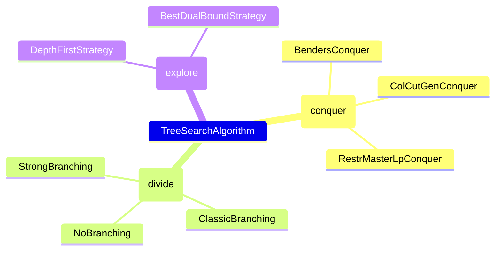
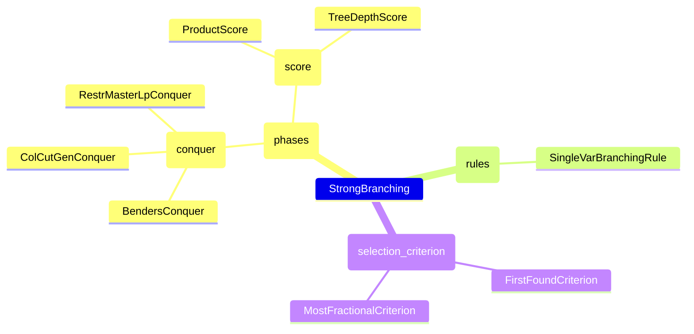

```@meta
CurrentModule = Coluna
```

# Built-in Algorithms

## Branch-and-Bound

Branch-and-Bound algorithm aims to find an optimal solution of a MIP by successive divisions of the search space. An introduction to the Branch-and-Bound algorithm can be found [here](https://en.wikipedia.org/wiki/Branch_and_bound). 

Coluna provides a generic Branch-and-Bound algorithm whose three main elements can be easily modified:

```@docs
Algorithm.TreeSearchAlgorithm
```

Conquer, divide algorithms and the explore strategy available with the `TreeSearchAlgorithm`
are listed in the following mind map. 



## Conquer algorithms

```@docs
Algorithm.BendersConquer
Algorithm.ColCutGenConquer
Algorithm.RestrMasterLpConquer
```

## Divide algorithms

```@docs
Algorithm.NoBranching
Algorithm.ClassicBranching
```


Strong branching is the main algorithm that we provide and it is the default implementation
of the `Branching` submodule. You can have more information about the algorithm by reading
the `Branching` submodule documentation.

```@docs
Algorithm.StrongBranching
```

All the possible algorithms that can be used within the strong branching are listed in the
following mind map.



## Explore strategies

```@docs
TreeSearch.DepthFirstStrategy
TreeSearch.BestDualBoundStrategy
```

## Cut generation algorithms

```@docs
Algorithm.BendersCutGeneration
```

```@docs
Algorithm.CutCallbacks
```

## Column generation algorithms

```@docs
Algorithm.ColumnGeneration
```


## External call to optimize a linear program

```@docs
Algorithm.SolveLpForm
```

## External call to optimize a mixed-integer program / combinatorial problem

```@docs
Algorithm.SolveIpForm
Algorithm.MoiOptimize
Algorithm.UserOptimize
Algorithm.CustomOptimize
```

