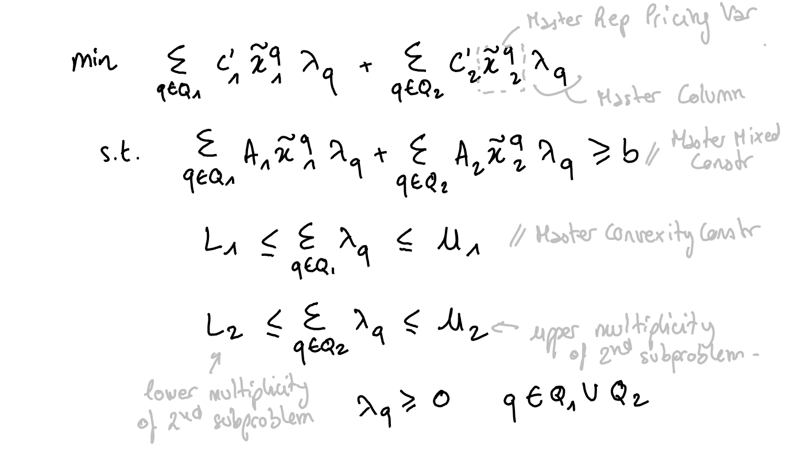

# Dantzig-Wolfe and Benders decompositions

Coluna is a framework to optimize mixed-integer programs that you can decompose.
In other words, if you remove the linking constraints or linking variables from you
program, you'll get sets of constraints (blocks) that you can solve independently.

Decompositions are typically used on programs whose constraints or variables can be divided into a set of "easy" constraints (respectively easy variables) and a set of "hard" constraints (respectively hard variables). Decomposing on constraints leads to Dantzig-Wolfe tranformation while decomposing on variables leads to Benders transformation. Both of these decompositions are implemented in Coluna. 

## Dantzig-Wolfe

### Classic Dantzig-Wolfe decomposition

Let's consider the following coefficient matrix that has a block diagonal structure
in gray and some linking constraints in blue :


You penalize the violation of the linking constraints in the
objective function. You can then solve the blocks independently.

The Dantzig-Wolfe reformulation gives raise to a master problem with an
exponential number of variables. Coluna dynamically generates these variables by
solving the subproblems. It's the column generation algorithm.

Let's consider the following original formulation in which we partition variables into
two vectors $x_1$ and $x_2$ :

```math
\begin{aligned}
\min \quad& c_1' x_1 + c_2' x_2 & \\
\text{s.t.} \quad& A_1 x_1 + A_2 x_2 \geq b & (1)\\
& D_1 x_1 \quad \quad \quad \geq d_1 & (2) \\
& \quad  \quad \quad D_2 x_2 \geq d_2 & (3) \\
\end{aligned}
```

When you apply a Dantzig-Wofe decomposition to this formulation, 
Coluna reformulates it into the following master problem :



where $Q_1$ is the index-set of the solutions to the first subproblem and 
$Q_2$ is the index-set of the solutions to the second subproblem.
The set of the solutions to the first and the second subproblems are $\{\tilde{x}^q_1\}_{q \in Q_1}$ and $\{\tilde{x}^q_2\}_{q \in Q_2}$ respectively. These solutions are expressed
in terms of the original variables.
The multiplicity of the subproblems is defined in the convexity constraints.
Lower and upper multiplicity are $1$ by default.

At the beginning of the column generation algorithm, the master formulation does
not have any master columns. Therefore, the master may be infeasible. 
To prevent this, Coluna adds a local artifical variable specific to each constraint of the master and a global artificial variable.
Costs of articial and global artificial variables can be defined in [Coluna.Params](@ref).

Subproblems take the following form (here, it's the first subproblem) :


where $\bar{c}$ is the reduced cost of the original variables computed by the column generation algorithm.

### Dantzig-Wolfe with identical subproblems (alpha)

When some subproblems are identical (same coefficient matrix and right-hand side), 
you can avoid solving all of them at each iteration by defining only one subproblem and
setting its multiplicity to the number of time it appears.

Let us see an example with Dantzig-Wolfe and a variant of the Generalized Assignment Problem.

Consider a set of machine type `T = 1:nb_machine_types` and a set of jobs `J = 1:nb_jobs`.
A machine type `t` has a resource capacity `Q[t]` and the factory contains `U[t]` machines of type `t`.
A job `j` assigned to a machine of type `t` has a cost `c[t,j]` and consumes `w[t,j]` resource units of the machine of type `t`.

Consider the following instance :

```@example identical
nb_machine_types = 2;
nb_jobs = 10;
J = 1:nb_jobs;
Q = [10, 15];
U = [3, 2];  # 3 machines of type 1 & 2 machines of type 2
c = [10 11 13 11 12 14 15 8 9 11; 20 21 23 21 22 24 25 18 19 21];
w = [4 4 5 4 4 3 4 5 6 5; 5 5 6 5 5 4 5 6 7 6];
nothing #hide
```

Here is the JuMP model to optimize this instance a classic solver : 

```@example identical
using JuMP, GLPK;

T1 = [1, 2, 3]; # U[1] machines
T2 = [4, 5]; # U[2] machines
M = union(T1, T2);
m2t = [1, 1, 1, 2, 2]; # machine id -> type id

model = Model(GLPK.Optimizer);
@variable(model, x[M, J], Bin); # 1 if job j assigned to machine m
@constraint(model, cov[j in J], sum(x[m,j] for m in M) == 1);
@constraint(model, knp[m in M], sum(w[m2t[m],j] * x[m,j] for j in J) <= Q[m2t[m]]);
@objective(model, Min, sum(c[m2t[m],j] * x[m,j] for m in M, j in J));

optimize!(model);
objective_value(model)
```

You can decompose over the machines by defining an axis on `M`.
However, if you want to take advantage of the identical subproblems, you must 
define the formulation as follows : 

```@example identical
using BlockDecomposition, Coluna, JuMP, GLPK;
const BD = BlockDecomposition

coluna = optimizer_with_attributes(
    Coluna.Optimizer,
    "params" => Coluna.Params(
        solver = Coluna.Algorithm.TreeSearchAlgorithm() # default BCP
    ),
    "default_optimizer" => GLPK.Optimizer # GLPK for the master & the subproblems
);

@axis(T, 1:nb_machine_types);

model = BlockModel(coluna);
@variable(model, x[T, J], Bin); # 1 if job j assigned to machine m
@constraint(model, cov[j in J], sum(x[t,j] for t in T) == 1);
@constraint(model, knp[t in T], sum(w[t] * x[t,j] for j in J) <= Q[t]);
@objective(model, Min, sum(c[t,j] * x[t,j] for t in T, j in J));
nothing #hide
```

We assign jobs to a type of machine and we define one knapsack constraint for
each type. This formulation cannot be solved as it stands with a commercial solver.

Then, we decompose and specify the multiplicity of each knapsack subproblem : 

```@example identical
@dantzig_wolfe_decomposition(model, dec_on_types, T);
sps = getsubproblems(dec_on_types)
for t in T
    specify!(sps[t], lower_multiplicity = 0, upper_multiplicity = U[t]);
end
getsubproblems(dec_on_types)
```
We see that subproblem for machine type 1 has an upper multiplicity equals to 3,
and the second subproblem for machine type 2 has an upper multiplicity equals to 2.
It means that we can use at most 3 machines of type 1 and at most 2 machines of type 2.

We can then optimize

```@example identical
optimize!(model);
```

and retrieve the disaggregated solution

```@example identical
for t in T
    assignment_patterns = BD.getsolutions(model, t);
    for pattern in assignment_patterns
        nb_times_pattern_used = BD.value(pattern);
        jobs_in_pattern = [];
        for j in J
            if BD.value(pattern, x[t, j]) ≈ 1
                push!(jobs_in_pattern, j);
            end
        end
        println("Pattern of machine type $t used $nb_times_pattern_used times : $jobs_in_pattern");
    end
end
```

## Benders (alpha)

Let's consider the following coefficient matrix that has a block diagonal structure
in gray and some linking variables in blue :


The intuition behind Benders decomposition is that some hard problems can become much easier with some of their variables fixed. 
Benders aims to divide the variables of the problem into two "levels": the 1st level variables which, once fixed, make it easier to find a solution for the remaining variables, the so-called 2nd-level variables.

The question is how to set the 1st level variables. Benders' theory proceeds by successive generation of cuts: given a first-level solution, we ask the following questions:

- Is the subproblem infeasible? If so, then the 1st-level solution is not correct and must be eliminated. A feasibility cut will be derived from the dual subproblem and added to the master.
- Does the aggregation of the master and subproblem solutions give rise to an optimal solution to the problem? It depends on a criterion that can be computed. If it is the case, we are done, else, we derive an optimality cut from the dual subproblem and add it into the master.

Formally, given an original MIP:

TODO: create and insert draw-handing picture as in DW section

we decompose it into a master problem:

TODO: same with MASTER

and a subproblem:

TODO: same with CGLP

Note that in the special case where the master problem is unbounded, the shape of the subproblem is slightly modified. We must retrieve an unbounded ray $$(u^*, u_0^*)$$ from the master and consider the following subproblem instead:

TODO: same with modified CGLP

The rules used to generate the cuts are detailed in [this paper](https://link.springer.com/chapter/10.1007/978-3-030-45771-6_7) 

(or TODO: describe the rules ? or ref to the different methods of the API that implement the cut generation process and should explain how cuts are generated)


This decomposition is an alpha feature.


